# ReviveAI — AI-Powered Revenue Recovery Platform

> **Track 03 — AI Revenue Recovery: Find revenue slipping away and win it back.**

ReviveAI is an event-driven, AI-powered revenue recovery platform that detects failed subscription payments, evaluates recovery potential, intelligently selects recovery strategies, validates decisions through policy controls, executes recovery actions, and measures recovered revenue end-to-end.

Instead of treating every failed payment the same way, ReviveAI combines **subscription health analysis, deterministic rules, machine learning, AI reasoning, policy validation, and recovery orchestration** to turn failed payments into actionable recovery opportunities.

---

## 🚨 Problem

Recurring payment failures directly put subscription revenue at risk.

Payments can fail because of:

- Expired cards
- Insufficient funds
- Invalid or outdated payment methods
- Other payment-related failures

A simple retry mechanism treats every failure similarly.

But effective revenue recovery requires understanding:

- Why did the payment fail?
- How likely is this revenue to be recovered?
- Which recovery strategy should be used?
- Can an AI-generated recommendation be safely executed?
- Did the customer actually recover the payment?
- How much revenue was recovered?

ReviveAI addresses these questions through an intelligent, event-driven recovery pipeline.

---

## 💡 Solution

ReviveAI transforms a failed payment into an intelligent **Recovery Case**.

The platform:

1. Receives payment events from Razorpay.
2. Validates webhook authenticity using HMAC-SHA256.
3. Publishes events through Kafka.
4. Uses Redis for idempotent event processing.
5. Processes the failed payment.
6. Evaluates subscription health.
7. Creates a Recovery Case containing the revenue at risk and failure context.
8. Uses machine learning to estimate recovery probability.
9. Uses deterministic rules to generate a recovery strategy.
10. Passes the ML and rule signals to an AI Recovery Agent.
11. Validates the AI recommendation through Policy Guard.
12. Executes the approved recovery action.
13. Waits for successful customer payment.
14. Processes the `payment.captured` event.
15. Matches the successful payment to the original failed payment and Recovery Case.
16. Marks the Recovery Case as `RECOVERED`.
17. Updates recovery metrics on the dashboard.

---
## 🎥 Demo

[▶️ Watch the ReviveAI Demo on YouTube](https://youtu.be/ZigXwidEHBA)

---

# 🏗️ System Architecture

ReviveAI follows an event-driven architecture designed to move from:

**Payment Failure → Intelligent Decision → Controlled Recovery → Successful Payment → Measurable Revenue Recovery**

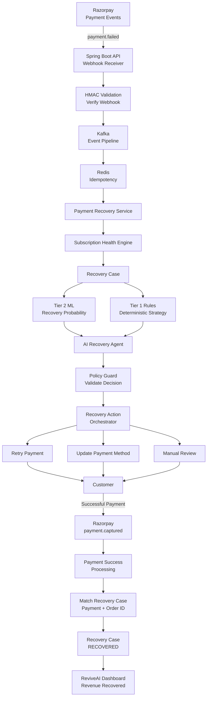

---

# 🔄 End-to-End Recovery Flow

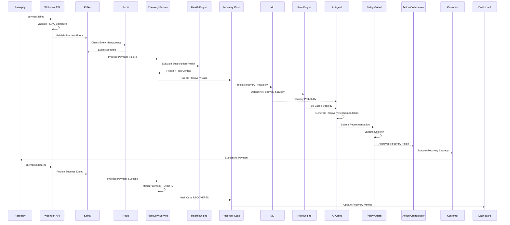

---

# 🧠 Intelligent Recovery Decision Pipeline

The intelligence layer combines **machine learning and deterministic rules** before sending their signals to the AI Recovery Agent.

The AI recommends a recovery action, while Policy Guard validates that recommendation before execution.

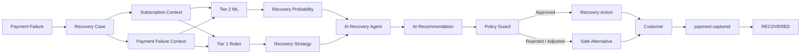

---

# 🔐 Webhook Security

ReviveAI validates incoming Razorpay webhooks using **HMAC-SHA256 signature verification**.

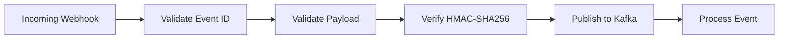

This ensures that webhook processing begins only after the request passes the required validation checks.

---

# ⚡ Event-Driven Processing

Kafka provides the event-driven backbone of ReviveAI.

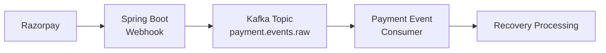

The webhook layer handles event ingestion while Kafka provides asynchronous event delivery to the recovery pipeline.

---

# ♻️ Redis Idempotency

Payment events can potentially be delivered more than once.

ReviveAI uses Redis-backed idempotency control to prevent duplicate processing.

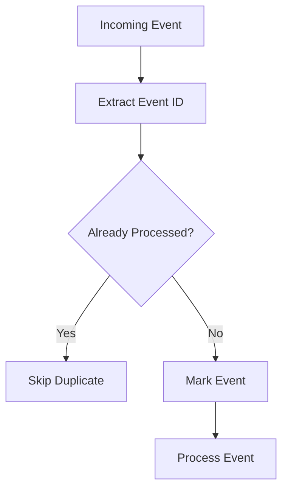

This helps prevent duplicate payment attempts and duplicate recovery processing.

---

# 💳 Payment Recovery Service

The Payment Recovery Service coordinates payment failure and payment success processing.

### Failed Payment Processing

The service:

- Validates the payment event.
- Validates payment and subscription identifiers.
- Validates the external order ID.
- Creates a failed Payment Attempt.
- Updates the subscription state.
- Evaluates subscription health.
- Creates the Recovery Case.
- Starts recovery analysis.

### Successful Payment Processing

The service:

- Validates the captured payment.
- Finds the corresponding failed payment.
- Matches the external order ID.
- Finds the associated Recovery Case.
- Updates the recovered amount.
- Marks the Recovery Case as `RECOVERED`.
- Reactivates the subscription.
- Records recovery completion.

---

# 📊 Subscription Health Engine

The Subscription Health Engine evaluates the customer's subscription context before downstream recovery decisions are made.

It considers information such as:

- Payment history
- Failure history
- Days past due
- Subscription state
- Recovery potential

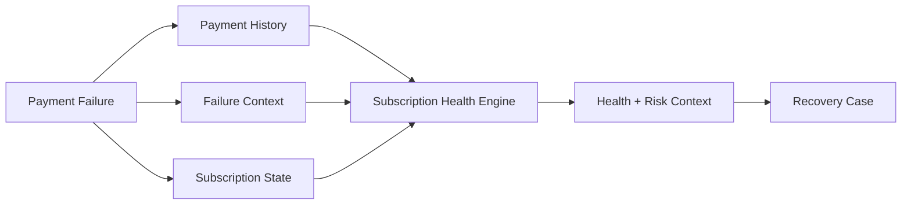

The resulting health context becomes part of the recovery decision process.

---

# 📁 Recovery Case

Every eligible payment failure becomes a **Recovery Case**.

A Recovery Case represents the revenue recovery problem ReviveAI is attempting to solve.

It contains recovery context such as:

- Amount at risk
- Amount recovered
- Recovery score
- Recovery potential
- Failure context
- Recovery strategy
- Recovery action
- Case status
- Timestamps
- Associated subscription
- Associated payment attempt

---

# 🔁 Recovery Case Lifecycle

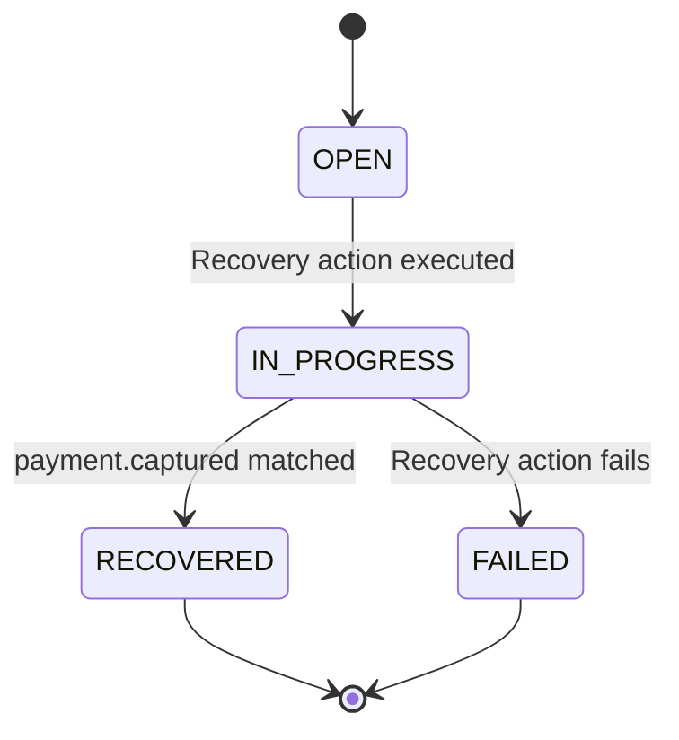

### Status Meanings

| Status | Meaning |
|---|---|
| `OPEN` | Recovery case has been created but has not completed recovery analysis/action |
| `IN_PROGRESS` | Recovery action has been executed and the system is waiting for successful payment |
| `RECOVERED` | Successful payment was received and matched to the recovery case |
| `FAILED` | Recovery action processing failed |

> **Important:** Executing a recovery action does not mean revenue has already been recovered. The case becomes `RECOVERED` only after a matching successful payment is processed.

---

# 🤖 Tier 2 Machine Learning

ReviveAI includes a machine-learning layer that predicts the probability of successful recovery.

The ML layer produces a:

**Recovery Probability**

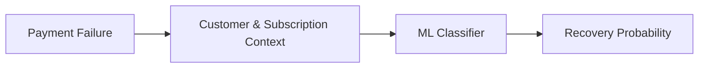

The prediction becomes one of the signals used by the AI Recovery Agent.

The ML layer does **not** directly execute recovery actions.

---

# 📐 Tier 1 Rule Engine

The rule engine provides deterministic recovery strategies based on known payment and recovery conditions.

Supported recovery strategies include:

| Strategy | Purpose |
|---|---|
| `RETRY_PAYMENT` | Attempt payment recovery |
| `UPDATE_PAYMENT_METHOD` | Request a valid payment method |
| `MANUAL_REVIEW` | Route the case for manual handling |

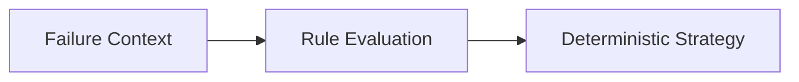

The rule-based strategy becomes another signal provided to the AI Recovery Agent.

---

# 🧠 AI Recovery Agent

The AI Recovery Agent combines:

- Recovery Case context
- Subscription health context
- ML recovery probability
- Rule-based recovery strategy

It then generates a recovery recommendation.

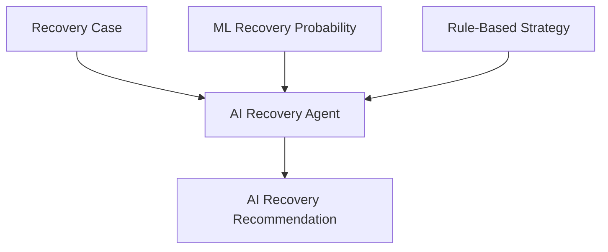

The AI provides reasoning and a recommended recovery action, but it does not have unrestricted authority to execute that action.

---

# 🛡️ Policy Guard

Policy Guard acts as the control layer between AI recommendations and actual recovery execution.

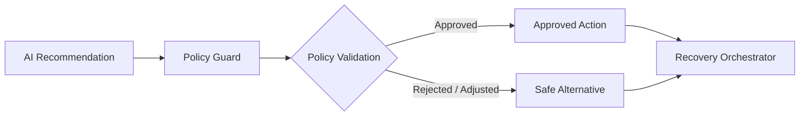

This creates a clear separation of responsibilities:

```text
AI
↓
Recommend

Policy Guard
↓
Validate

Recovery Orchestrator
↓
Execute
```

The AI does not directly control the recovery execution layer.

---

# ⚙️ Recovery Action Orchestrator

The Recovery Action Orchestrator executes the approved recovery strategy.

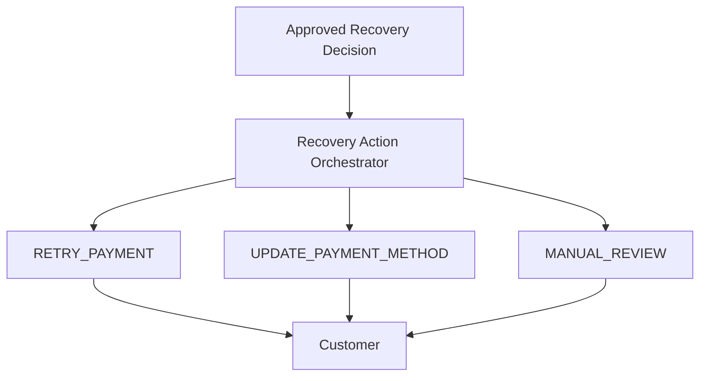

This keeps decision-making and action execution separated.

---

# 🔄 Closed-Loop Revenue Recovery

ReviveAI is designed as a **closed-loop recovery system**.

The workflow does not end when an action is executed.

It ends when successful payment is confirmed.

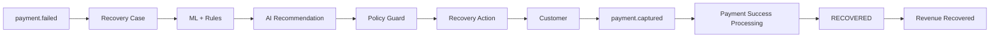

> **A recovery action is an attempt. A successful payment is the recovery outcome.**

---

# 📈 Dashboard

ReviveAI provides a dashboard for monitoring revenue recovery performance.

The dashboard includes:

- Revenue at Risk
- Revenue Recovered
- Recovery Rate
- Active Cases
- Average Recovery Probability
- High-Risk Subscriptions
- Automated Recoveries
- Manual Reviews
- Recovery Trend

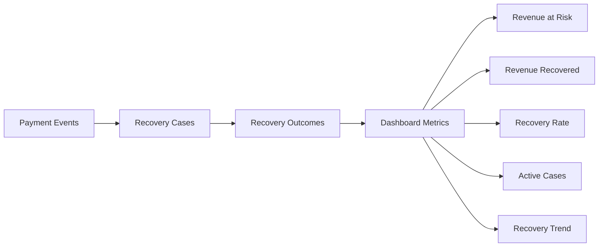

The dashboard provides a business-level view of the recovery pipeline.

---

# 🧪 Demo Payment Simulation

ReviveAI includes a clearly labeled demo feature:

**Demo: Simulate Successful Payment**

This feature is intended for demonstrations and testing.

It simulates a successful payment confirmation for an existing `IN_PROGRESS` Recovery Case while reusing the existing payment-success processing path.

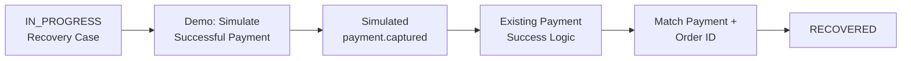

This allows the complete recovery lifecycle to be demonstrated without requiring a real customer payment.

---

## 🖥️ Dashboard Preview

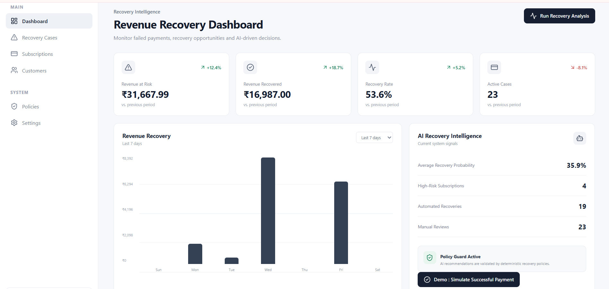

# 💰 Example Recovery Scenario

Consider a subscription worth **₹1,299**.

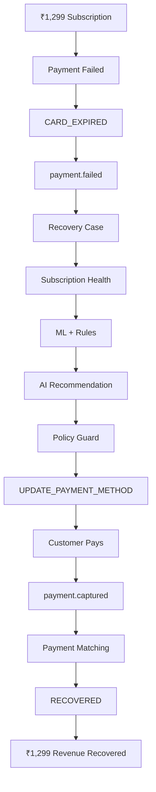

The important point is that ReviveAI doesn't stop at identifying the failed payment.

It follows the payment through the complete recovery lifecycle.

---

# 🔒 Reliability & Safety

ReviveAI incorporates multiple controls throughout the recovery pipeline.

### Webhook Verification

HMAC-SHA256 validation protects the webhook entry point.

### Event Idempotency

Redis prevents duplicate webhook events from being processed repeatedly.

### Kafka Event Processing

Kafka decouples webhook ingestion from downstream recovery processing.

### Payment Validation

Payment events are validated before recovery records are created.

### External Order ID Matching

Successful payments are matched against the external order ID and failed payment context.

This prevents an unrelated successful payment from incorrectly completing a recovery case.

### Policy Guard

AI recommendations pass through policy validation before recovery execution.

### Recovery Confirmation

A case is marked `RECOVERED` only after a matching successful payment event is processed.

### Auditability

Recovery decisions and actions maintain associated recovery context and execution information for traceability.

---

# 🧰 Technology Stack

## Backend

- Java 21
- Spring Boot 4.1.1
- Spring Web
- Spring Security
- Spring Data JPA
- Hibernate
- Lombok
- Bean Validation

## Database

- PostgreSQL 16
- pgvector

## Event Streaming

- Apache Kafka
- Confluent ZooKeeper

## Caching & Idempotency

- Redis 7

## Payments

- Razorpay Webhooks
- HMAC-SHA256 Signature Validation
- Razorpay Java SDK

## AI / ML

- Spring AI
- Ollama
- Machine Learning Classifier
- pgvector-based retrieval support

## Frontend

- React
- Vite
- Axios
- Lucide React

## Infrastructure & Development

- Maven
- Docker
- Docker Compose
- Git
- GitHub

---

# 📂 Project Structure

```text
reviveai/
│
├── frontend/
│   └── React + Vite dashboard
│
├── src/
│   └── main/
│       └── java/
│           └── com/reviveai/
│               │
│               ├── config/
│               ├── dashboard/
│               ├── payment/
│               ├── recovery/
│               ├── subscription/
│               ├── webhook/
│               ├── ai/
│               ├── ml/
│               ├── policy/
│               └── action/
│
├── docker-compose.yml
├── init-pgvector.sql
├── pom.xml
├── mvnw
├── mvnw.cmd
└── README.md
```

---

# 🚀 Local Development

## Prerequisites

Install or configure:

- Java 21
- Maven or Maven Wrapper
- Docker Desktop
- Docker Compose
- Node.js
- npm
- Ollama

---

## 1. Start Infrastructure

From the project root:

```bash
docker compose up -d
```

The Docker Compose environment provides:

- PostgreSQL with pgvector
- Redis
- Kafka
- ZooKeeper

Check the containers:

```bash
docker compose ps
```

---

## 2. Start the Backend

From the project root:

### Windows

```cmd
mvnw.cmd spring-boot:run
```

Backend:

```text
http://localhost:8080
```

Health endpoint:

```text
http://localhost:8080/actuator/health
```

---

## 3. Start the Frontend

Open another terminal:

```cmd
cd frontend
npm install
npm run dev
```

Frontend:

```text
http://localhost:5174
```

---

# 🔌 API Endpoints

## Dashboard

### Get Dashboard Overview

```http
GET /api/dashboard/overview
```

Returns:

- Revenue at risk
- Revenue recovered
- Recovery rate
- Active cases
- Average recovery probability
- High-risk subscriptions
- Automated recoveries
- Manual reviews
- Recovery trend
- Latest recovery case

---

### Run Recovery Analysis

```http
POST /api/dashboard/recovery-analysis
```

Runs recovery analysis for eligible recovery cases.

---

### Simulate Successful Payment

```http
POST /api/dashboard/recovery-cases/{recoveryCaseId}/simulate-success
```

Demo/testing endpoint that simulates a successful payment for an `IN_PROGRESS` Recovery Case.

---

# 🌐 Payment Webhook API

Razorpay webhook endpoint:

```http
POST /api/webhooks/razorpay
```

The endpoint validates:

1. Request payload
2. Event ID
3. HMAC signature
4. Event structure

The validated event is then published to Kafka for downstream processing.

---

# 🔄 Payment Event Flow

## Failed Payment

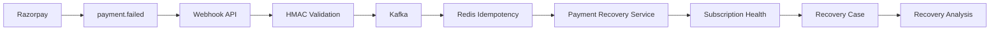

## Successful Payment

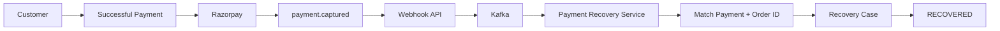

---

# 📡 Observability

ReviveAI includes Spring Boot Actuator support for application health monitoring.

Health endpoint:

```http
GET /actuator/health
```

Application logs provide visibility into:

- Webhook reception
- Signature validation
- Kafka event processing
- Redis idempotency
- Payment processing
- Subscription health evaluation
- Recovery case creation
- ML prediction
- Rule evaluation
- AI recommendation
- Policy validation
- Recovery action execution
- Payment success processing
- Recovery completion

---

# 🆚 Why ReviveAI Is Different

Traditional recovery systems often rely on fixed retry schedules.

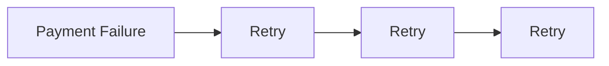

ReviveAI introduces an intelligence and control layer:

```mermaid
flowchart LR
    A["Payment Failure"] -->
    B["Understand Context"] -->
    C["Subscription Health"] -->
    D["ML Prediction"] -->
    E["Rule Evaluation"] -->
    F["AI Recommendation"] -->
    G["Policy Validation"] -->
    H["Recovery Action"] -->
    I["Successful Payment"] -->
    J["Measure Revenue"]
```

The result is a move from simple payment retrying toward **context-aware, controlled, measurable revenue recovery**.

---

# ⭐ Key Engineering Highlights

### Event-Driven Architecture

Kafka decouples payment event ingestion from downstream recovery processing.

### Secure Webhook Processing

HMAC-SHA256 validation protects the webhook entry point.

### Idempotent Event Processing

Redis prevents duplicate webhook events from creating duplicate recovery operations.

### Subscription-Aware Recovery

Subscription health provides additional context before recovery decisions are made.

### Intelligent Decision Making

ML, deterministic rules, and AI reasoning are combined instead of relying on a single decision mechanism.

### AI With Guardrails

Policy Guard validates AI recommendations before recovery actions are executed.

### Closed-Loop Recovery

Successful payment confirmation determines whether revenue was actually recovered.

### Revenue Visibility

The dashboard converts individual payment recovery events into business-level recovery metrics.

---

# 🏆 Buildathon Track Alignment

## Track 03 — AI Revenue Recovery

> **Find revenue slipping away and win it back.**

ReviveAI directly addresses this challenge by turning failed subscription payments into intelligent recovery workflows.

```mermaid
flowchart LR
    A["DETECT<br/>Payment Failure"] -->
    B["DIAGNOSE<br/>Subscription Health"] -->
    C["PREDICT<br/>ML Recovery Probability"] -->
    D["DECIDE<br/>Rules + AI"] -->
    E["VALIDATE<br/>Policy Guard"] -->
    F["ACT<br/>Recovery Action"] -->
    G["RECOVER<br/>payment.captured"] -->
    H["MEASURE<br/>Dashboard"]
```

### Detect

Identify failed subscription payments through Razorpay events.

### Diagnose

Understand payment and subscription failure context.

### Predict

Estimate recovery probability using machine learning.

### Decide

Combine deterministic rules with AI reasoning.

### Validate

Use Policy Guard to control AI-generated recovery decisions.

### Act

Execute an appropriate recovery strategy.

### Recover

Confirm successful payment through `payment.captured`.

### Measure

Track recovered revenue and recovery performance through the dashboard.

---

# 🎬 Demo Flow

A complete ReviveAI demonstration can follow this sequence:

```mermaid
flowchart TD
    A["Send payment.failed Webhook"] -->
    B["HMAC Validation"] -->
    C["Kafka Event"] -->
    D["Redis Idempotency"] -->
    E["Payment Failure Processing"] -->
    F["Subscription Health"] -->
    G["Recovery Case Created"] -->
    H["ML Prediction"] -->
    I["Rule Evaluation"] -->
    J["AI Recommendation"] -->
    K["Policy Guard"] -->
    L["Recovery Action"] -->
    M["Case IN_PROGRESS"] -->
    N["Demo: Simulate Successful Payment"] -->
    O["payment.captured"] -->
    P["Payment + Order ID Matching"] -->
    Q["Case RECOVERED"] -->
    R["Dashboard Updated"]
```

---

# 📌 Complete Recovery Example

```mermaid
flowchart TD
    A["₹1,299 Subscription"] -->
    B["Payment Failed"] -->
    C["CARD_EXPIRED"] -->
    D["payment.failed"] -->
    E["Recovery Case"] -->
    F["Subscription Health"] -->
    G["ML Recovery Probability"] -->
    H["Rule-Based Strategy"] -->
    I["AI Recovery Agent"] -->
    J["AI Recommendation"] -->
    K["Policy Guard"] -->
    L["Approved Recovery Action"] -->
    M["Customer Pays"] -->
    N["payment.captured"] -->
    O["Payment + Order ID Matching"] -->
    P["RECOVERED"] -->
    Q["₹1,299 Revenue Recovered"]
```

---

# 🔮 Future Enhancements

Potential future improvements include:

- More advanced recovery prediction models
- Additional payment failure classifications
- Customer-specific recovery strategies
- More recovery channels
- Email/SMS/notification integrations
- Advanced recovery analytics
- Recovery strategy experimentation
- Multi-provider payment integrations
- Production-grade distributed deployment
- More sophisticated policy configuration

---

# 🎯 Conclusion

ReviveAI is built around a simple idea:

> **A failed payment should not automatically become lost revenue.**

The platform combines:

**Event-Driven Processing + Payment Security + Idempotency + Subscription Health + Machine Learning + Rules + AI + Policy Guard + Recovery Orchestration + Closed-Loop Payment Confirmation**

to create an end-to-end revenue recovery platform.

```mermaid
flowchart LR
    A["Detect"] -->
    B["Diagnose"] -->
    C["Predict"] -->
    D["Decide"] -->
    E["Validate"] -->
    F["Act"] -->
    G["Recover"] -->
    H["Measure"]
```

**ReviveAI doesn't just detect payment failures. It intelligently decides, safely executes, and measures the recovery from end to end.**

---

# 👨‍💻 Author

**[Karthik Nandagiri](https://github.com/Karthik-nan)**

🔗 **GitHub:** [Karthik-nan](https://github.com/Karthik-nan)  
🚀 **ReviveAI Repository:** [github.com/Karthik-nan/reviveai](https://github.com/Karthik-nan/reviveai)

---

## ReviveAI

**AI-Powered Revenue Recovery Platform**

Built for the **Razorpay Buildathon — AI Revenue Recovery Track**.
